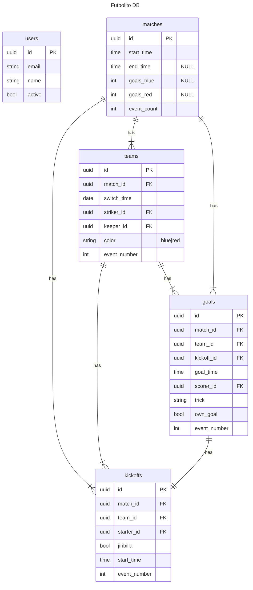

### Yaa tio

### Frontend Setup

1. `cd frontend`
1. `npm install`
1. `npm run dev`

### Backend setup

1. Download pockbase version 0.22.*
  - https://pocketbase.io/docs
  - https://github.com/pocketbase/pocketbase/releases
2. Move the executable to the backend folder
1. `cd backend`
1. `./pocketbase serve`

### Terraform first time setup

1. Download terraform
1. Download and configure aws cli
1. `cd tf`
1. `terraform init`

### Notes

If you run `npm run build`, the output directory will point to pb_bublic in the backend folder.

### ER Diagram Ver. 2

